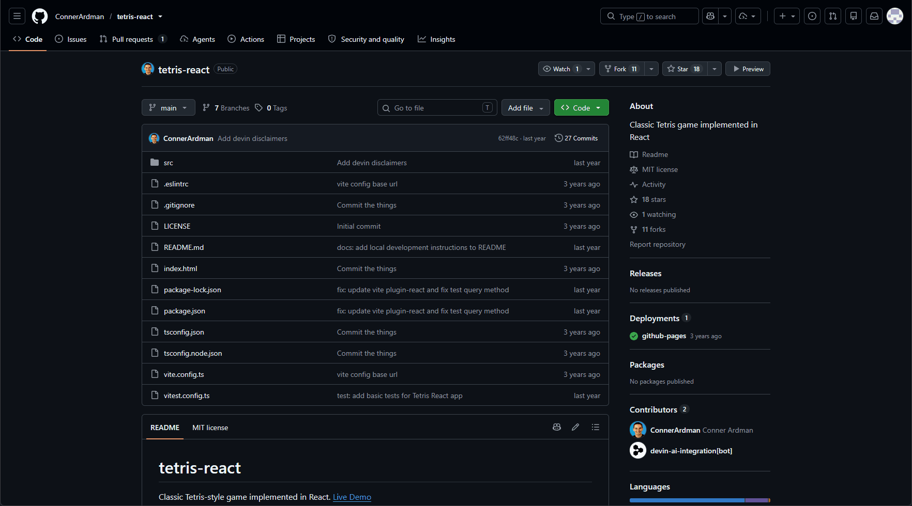

# Stackyard

Preview any public GitHub repo running live, right from its repo page — no clone, no local install.

[](https://github.com/MatthewW05/Stackyard/actions/workflows/ci.yml)
[](./LICENSE)

> **Status:** the core preview loop is complete and working end to end in both Chrome and Firefox. Not yet published to the Chrome Web Store or Firefox Add-ons — see [Getting Started](#getting-started) to run it from source.

## Demo



Signed in through the extension (for the higher 5,000 requests/hour rate limit) — clicking **Preview** on a repo page, then a quick play-through of a small React app once the live dev server finishes booting. Demo repo: [ConnerArdman/tetris-react](https://github.com/ConnerArdman/tetris-react).

## Table of Contents

- [Demo](#demo)
- [Features](#features)
- [How It Works](#how-it-works)
- [Getting Started](#getting-started)
- [Scope & Limitations](#scope--limitations)
- [Privacy & Permissions](#privacy--permissions)
- [Development](#development)
- [Credits](#credits)
- [License](#license)

## Features

- **One-click live preview** — a "Preview" button is injected directly into GitHub's own repo header UI; no separate site to visit first.
- **Runs a real dev server, not a mock** — boots an actual Node.js environment in the browser via [WebContainers](https://webcontainers.io/), runs `npm install` and the repo's detected dev/start script, and streams the install/build output live.
- **Static-site fallback** — repos with no `package.json` (plain HTML/CSS/JS) are served directly instead of failing.
- **Honest failure states** — repo types that can't run in this sandbox (Python, Ruby, Java, and other non-Node stacks) get a specific, immediate explanation instead of a silent hang or a generic error.
- **Optional GitHub sign-in** — OAuth Device Flow, running entirely inside the extension with no backend server. Raises the API rate limit from 60 to 5,000 requests/hour and unlocks private-repo previews.
- **On-by-default caching** — a local TTL cache plus ETag-based revalidation means repeat visits to the same repo are near-instant and don't cost extra API calls, without ever serving stale data.
- **Cross-browser** — Chrome and Firefox are both fully supported, including WebContainers' cross-origin-isolation requirements (see [`WEBCONTAINER_NOTES.md`](./WEBCONTAINER_NOTES.md) for the Firefox-specific gotchas this took to get right).

## How It Works

1. A content script matches GitHub repo pages and injects a **Preview** button into the existing header UI.
2. Clicking it asks the background script to open a new tab pointed at Stackyard's hosted preview page (on Vercel), passing the repo's `owner`/`repo` as query params.
3. The hosted page can't run inside the extension itself — Firefox doesn't allow a packaged extension page to become cross-origin isolated, which `WebContainer.boot()` requires (see [`WEBCONTAINER_NOTES.md`](./WEBCONTAINER_NOTES.md)). Hosting it as a real page lets it set its own COOP/COEP headers in every browser instead.
4. The hosted page never talks to GitHub directly. It relays every request through the extension — page → content script → background script → GitHub's REST API — so a visitor without the extension installed can't pull real repo data through it at all (see [Privacy & Permissions](#privacy--permissions)).
5. The extension fetches the repo's file tree and returns it to the page, which mounts it into a WebContainer, detects the project type (Node project vs. static site vs. unsupported), runs `npm install` and the dev/start script, and points an iframe at the running dev server once it's ready.

## Getting Started

Stackyard isn't published to the Chrome Web Store or Firefox Add-ons yet — for now, install it from source.

### Install the extension

```bash
git clone https://github.com/MatthewW05/Stackyard.git
cd Stackyard
npm install
npm run build           # Chrome (Manifest V3)
npm run build:firefox   # Firefox (Manifest V2)
```

Then load the unpacked build:

- **Chrome:** go to `chrome://extensions`, enable Developer Mode, click "Load unpacked", and select `.output/chrome-mv3`. This install persists across restarts.
- **Firefox:** go to `about:debugging#/runtime/this-firefox`, click "Load Temporary Add-on", and select `.output/firefox-mv2/manifest.json`. Regular release Firefox only allows unsigned extensions to be loaded _temporarily_ this way — it's removed on restart, and needs reloading each time, until this is published on addons.mozilla.org. For a persistent install now, Firefox Developer Edition or Nightly can disable signature enforcement (`xpinstall.signatures.required` in `about:config`) and install the same build permanently via `about:addons` → gear icon → "Install Add-on From File".

### Use it

1. Open any public GitHub repository page (e.g. `github.com/<owner>/<repo>`).
2. Click the **Preview** button injected next to Star/Fork/Watch.
3. A new tab opens Stackyard's hosted preview page, which boots a WebContainer, fetches the repo's files, installs dependencies, and runs its dev server — all in the browser, with no clone and no local install.
4. Optional: open the extension popup and sign in with GitHub to raise the API rate limit from 60 to 5,000 requests/hour and preview private repos you have access to.

## Scope & Limitations

Stackyard runs real project code inside the browser via WebContainers — that's powerful, but it has real edges. This section is deliberately explicit about them.

**Supported repos**

- Node/JavaScript/TypeScript projects with a `package.json` and a detectable dev/start script — verified against Vite, Create React App, and Next.js (dev mode), plus Vue and Svelte projects.
- Monorepos / multiple `package.json` files, using the same package-location logic as single-package repos.
- Static sites with no `package.json` (plain HTML/CSS/JS) — served through a fallback static file server instead of failing.

**Not supported, by design**

- Non-Node backend stacks — Python (`requirements.txt`, `.py` files), Ruby (`Gemfile`), Java (`pom.xml`), and similar. WebContainers only runs Node.js, so these produce an immediate, specific "not supported" message rather than a silent failure or a hang.
- AI-assisted configuration for repos that fail standard detection isn't built. A repo that fails detection today shows a plain failure message rather than an AI-suggested fix.

**Browsers**

- Chrome and Firefox on desktop are both fully supported, including WebContainers' `SharedArrayBuffer` / cross-origin-isolation requirements. Firefox needed real investigation to get right — see [`WEBCONTAINER_NOTES.md`](./WEBCONTAINER_NOTES.md) for the packaged-extension-page limitation this project hit and worked around.
- Safari and mobile browsers are out of scope.
- Firefox surfaces a handful of harmless console warnings from `@webcontainer/api`'s own bundled code and StackBlitz's hosted runtime (a `Feature Policy` warning and a rejected third-party cookie). They don't affect functionality — documented in [`WEBCONTAINER_NOTES.md`](./WEBCONTAINER_NOTES.md) rather than treated as a bug to fix.

**GitHub API limits**

- 60 requests/hour unauthenticated, 5,000/hour signed in. Large repos with many files can use up the unauthenticated limit quickly. The on-by-default cache (TTL + ETag revalidation) and signing in both help; the preview page surfaces remaining requests so it's never a surprise.

**Extension detection is a UX nudge, not a hard security boundary**

- The hosted preview page checks for a marker the extension's content script sets, and shows an "install the extension" landing state if it's missing. This steers stray visitors correctly; the hosted page also has no direct path to GitHub regardless, since every request is relayed through the extension — see [Privacy & Permissions](#privacy--permissions).

**Licensing**

- [WebContainers](https://webcontainers.io/) (StackBlitz) requires a commercial license for production use in a for-profit setting. Stackyard is a personal/portfolio project, not a commercial product — worth knowing before adapting this code for something that is.

## Privacy & Permissions

The extension requests three permissions; each one is scoped to a specific, necessary purpose:

| Permission                               | Why                                                                                                                                                                                                                                                                                    |
| ---------------------------------------- | -------------------------------------------------------------------------------------------------------------------------------------------------------------------------------------------------------------------------------------------------------------------------------------- |
| `host_permissions: https://github.com/*` | Needed only for the OAuth Device Flow endpoints (`github.com/login/device/code`, `github.com/login/oauth/access_token`), which don't send CORS headers permissive enough for a plain fetch. Regular GitHub API reads (`api.github.com`) don't need this — GitHub allows those already. |
| `storage`                                | Persists the signed-in GitHub token and the repo cache locally in the browser (`chrome.storage.local`). Never sent anywhere except directly to GitHub's own API.                                                                                                                       |
| `alarms`                                 | Drives the OAuth Device Flow's poll loop from the background service worker — a plain `setTimeout` isn't reliable, since Manifest V3 can suspend the worker mid-wait.                                                                                                                  |

Beyond that:

- **No analytics, telemetry, or tracking** is added by this project. (The hosted preview page does embed StackBlitz's WebContainer runtime to actually run the container, which is third-party code outside this project's control — see the cookie note in [`WEBCONTAINER_NOTES.md`](./WEBCONTAINER_NOTES.md).)
- **The hosted preview page never talks to GitHub directly.** Every request — fetching a repo's files, checking the rate limit — is relayed through the extension: page → content script → background script → GitHub's REST API, and the result relayed back the same way. A visitor who reaches the hosted page without the extension installed can't pull real repo data through it at all.
- **Signing in requests full `repo` scope** (GitHub's Device Flow doesn't offer a narrower read-only grant for private repos). The resulting token stays in local extension storage and is only ever sent to GitHub's own API.

## Development

Built with [WXT](https://wxt.dev/) (React + TypeScript) for the extension, and [Vite](https://vitejs.dev/) + [`@webcontainer/api`](https://www.npmjs.com/package/@webcontainer/api) for the hosted preview page, targeting Chrome and Firefox.

**Build environment:** Node.js 22.x (npm bundled with it) on any OS — Windows, macOS, or Linux. CI ([`.github/workflows/ci.yml`](./.github/workflows/ci.yml)) builds on `ubuntu-latest` with Node 22.

### Extension

```bash
npm install

npm run dev           # Chrome, with HMR
npm run dev:firefox   # Firefox, with HMR

npm run build          # production build, Chrome
npm run build:firefox  # production build, Firefox

npm run test     # Vitest
npm run lint     # ESLint
npm run format   # Prettier (writes)
npm run compile  # TypeScript check, no emit
```

Loading the unpacked build:

- **Chrome:** `chrome://extensions` → enable Developer Mode → "Load unpacked" → select `.output/chrome-mv3`
- **Firefox:** `about:debugging#/runtime/this-firefox` → "Load Temporary Add-on" → select `.output/firefox-mv2/manifest.json`

### Hosted preview page

Lives in [`preview-page/`](./preview-page) as its own Vite project, deployed separately to Vercel:

```bash
cd preview-page
npm install

npm run dev      # local dev server, with credentialless COOP/COEP headers
npm run test     # Vitest
npm run build    # production build
```

CI ([`.github/workflows/ci.yml`](./.github/workflows/ci.yml)) runs formatting, linting, type-checking, both extension builds, and the preview page's tests and build on every push/PR to `main`.

## Credits

Live previews are powered by [WebContainers](https://webcontainers.io/) — [StackBlitz](https://stackblitz.com/)'s in-browser Node.js runtime, which is what makes booting a real dev server without a backend server possible at all. See [Scope & Limitations](#scope--limitations) for a licensing note on production/commercial use.

Built with [WXT](https://wxt.dev/), [React](https://react.dev/), and [Vite](https://vitejs.dev/).

## License

[MIT](./LICENSE) © Matthew Wong
